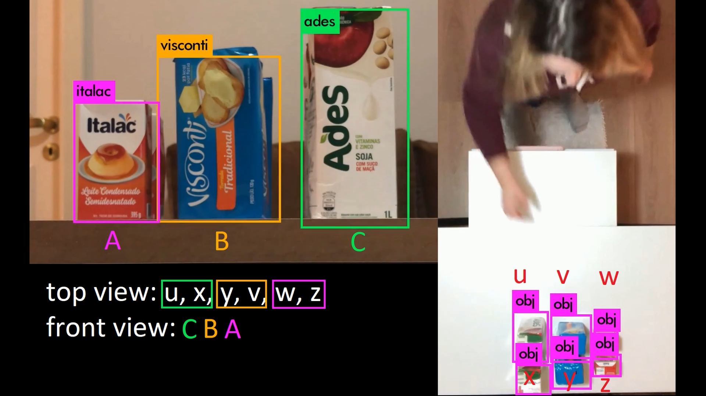

# SuperFuturo
* Front
https://github.com/NicolasCendron/SuperDoFuturoFront

## How to run project
	1. open front end node js app
	2. run backend app (this)
	3. open index.html page and log in
	4. go to darknet project and run `start_parsers.sh`
	5. changes should be updated in the website

## How to debug backend
	1. open existing project in Intellij IDEA 
	2. open class `com.ufrgs.superfuturo.SuperfuturoApplication` and debug `SuperfuturoApplication.main()`
	3. you will now stop at any existing breakpoints

## Logic module documentation

Product Withdrawal/Return Logic:
The logic module interacts with the Parser module. We asynchronously receive both front and top parsers result, which are arrays of specific objects for the front parser and arrays of generic object for the top parser.
Each view provides different information. The front view is very good at determining object type, for example it's very easy to differentiate a coke can from a pepsi can in the front view, but not from the top. On the other side, it is way easier for the top view to count number of products in a row, while the front view would have a very hard time doing so accurately.
However to properly identify Withdrawal/Return events we need both a consistent way for identifying the type of the product as well as a safe way to register quantity delta. 
Given these considerations, we opted to give the first iteration a limitation: products can only be withdrawn or returned to the front row. This way we always know what type of object we are changing.

Algorithm

Updating the views:
We have 3 variables that store the views.
1. top view: updated as soon as new data arrives.
2. front view: updated if new data arrives and the state (new front view with current top view) is still consistent.
3. inconsistent front view: updated if new data arrives and state is not consistent. This is needed as the top view might be updated after front view, making it consistent.
* consistency here refers to the fact that, if top view has n columns, front view should also have the same number of columns. If it does not, it is probably due to an occlusion, but we do not outright accept this state and wait for stabilization.

Generating new shelf state:
Once top view is updated, we also set a flag that indicates we are expecting an update soon.
From this state, three things can happen:
1 - a new update from the front arrives, immediately after it is updated, we try to commit the new state
2 - no updates from the front arrives before TIMEOUT (see `Constants.TIMEOUT` for configuration), triggering the timeout logic
3 - an inconsistent state is reached, triggering an exception (this can happen at the same time as 1 or 2 as well, but this behavior takes priority over the others. However, this might be too strong of a constraint for a real world scenario though)

commit logic:
here is where we actually commit and try to imply something given our old and current state.
We first try to create a new ShelfState (see @ref Building new ShelfState instance)
Then we need to get a delta report between those two states (see @ref Getting ShelfDeltaReports)
finally we register all these reported changes as buy or return of products.

Building new ShelfState instance:
ShelfState is what we use to represent the correlation between the front view and the top view. AS we seen, the top view is the leader of the events, as it is the single source of truth regarding product withdrawal/return. Even if front view changes, we ignore it until top view also suffers a delta, as it could have been just an occlusion. Once a change is detected in the top view, the front view will be used to deduce what type of product was removed.
This was done by grouping the products into rows and associating a leader for each row, for example:
```
let group G = {X, Y, Z}; and shelf row i = {0, 1, 2}
the i-th member of a Group G is represented by Gi. Gi does not necessarily need to be the same type of Gi+1 for the algorithm to work.
   __________
2  |X2 Y2 Z2|
1  |X1 Y1 Z1|
0  |X0 Y0 Z0|   <- this is the row that is visible for the front parser (row 0) (X0 Y0 Z0)
    @/ 
   /|      <- Customer
   / \
```

Here we have 3 rows (groups), X, Y, Z; each with 3 instances 0, 1, 2.
These are by grouped sorting the top view and iterating through the list. If the difference in the horizontal position is lower than the tolerance (see `Constants.DX_TOLERANCE`), these products are put into the same group (in the sketch above it means the same column). Each of this groups would have a leader, which is the member of a group that is also being shown in the front view (in the sketch it would be the 0-th member of a group).

Quick note:
Depending on the reference between the cameras it might be that the leftmost column shown in the top view is the rightmost column shown in the front view, as example below:



You can clearly see that the `Ades` type product in the top view, represented by letter `C`, is actually the `u` of the top view. That means that the rightmost product in the front view is the leftmost product in the top view.
Therefore in this case it would require to invert one of the lists (usually the front view is easier to manage) to map properly. For now this is hardcoded as we only have one top and one front view. Eventually the parsers should not be static and this should be configurable inside the parsers.

Getting ShelfDeltaReports

With both the old ShelfState and current ShelfState, we compare group by group to try to imply what actually happened. However these groups might not be in the exact same position anymore, so we again need a tolerance to determine what we consider as "same group". Currently the same `Constants.DX_TOLERANCE` is being used but this could be another value, if there is need to. After we paired each group from the old shelf with the new shelf, we know that, with our limitation, only the frontmost product could be removed/added from each group, so we can simply get the difference in number between the two groups.

If the number of products in that group has gone up by one, we consider this a return of a product with the type of the leader of the *new* ShelfState.
If the number of products in that group has gone down by one, we consider this a buy of a product with the type of the leader of the *old* ShelfState.
If the number of products in that group hasn't changed, we consider no changes have been done

Improvement idea:
One of the main limitations of the current design is that we are only able to make changes in the frontmost row of each group.
Ideally we would want the top parser to also be able to identify object type, which would give us a better understanding of the overall architecture and allow for more resillience against unpredicted scenarios. However as mentioned before it is considerably harder to imply the type of object from the top view. One alternative to this is to maybe create a "load" procedure, where the products are loaded row by row and the software could then keep a memory of the objects, for example:

```
 _________            _________            _________            _________
 |A  B  C| -> load -> |A  B  C|            |A  B  C|            |A  B  C|
                      |D  E  F| -> load -> |D  E  F|            |D  E  F|
                                           |G  H  I| -> load -> |G  H  I|
```
So in this case, even if we cannot see the products of the middle row anymore with the front camera, we still know it was an D E F as we have that loaded into memory. This could help both remove the limitation, as well as help with the accuracy of multiple other scenarios, reducing false positives and false negatives.

Related code: You will find most of the implementations of what is described here in classes YoloParserLogic, SuperFuturoLogic, ShelfState and ShelfDeltaReport. However, keep in mind this is not an exaustive list.